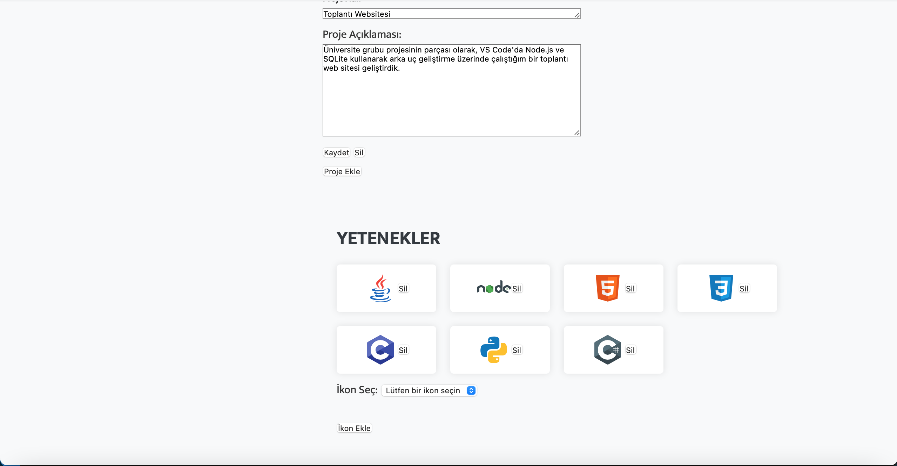

# Portfolyo Websitesi

Bu site, kişisel ve mesleki bilgilerinizi sunmak için tasarlanmış bir web uygulamasıdır. Ziyaretçilere sizin hakkınızda daha fazla bilgi edinme ve çalışmalarınızı gözden geçirme imkanı sağlar.

## Özellikler

- Hakkımda: Kişisel bilgiler, eğitim geçmişi ve kariyer hedefleri hakkında bilgiler.
- Özgeçmiş: Eğitim ve iş deneyimleri hakkında detaylı bilgiler.
- Projeler: Geliştirilen projelerin tanıtımı ve açıklamaları.
- Yetenekler: Programlama dilleri yeteneklerini gösteren simgeler.
- İletişim: İletişim Formu.

## Kullanılan Teknolojiler
- Frontend: HTML, CSS, JavaScript
- Backend: Node.js, Express.js, MongoDB Atlas

## Kurulum

1. Depoyu indirin veya klonlayın:
```bash
    git clone https://github.com/esmaozbalta/Portfolio-website.git <proje_adi>
```
2. Klasörünüzün içine girin:
```bash
    cd <proje_adi>
```
3. Gerekli bağımlılıkları yükleyin:
```bash
    npm install
    npm install express
    npm install mongoose
```

4. Veri tabanını bağlayın:

server/admin.js sayfasindaki kodu kendi veri tabanı bilgilerinize göre güncelleyin.
```bash
mongodb+srv://<kullaniciadi>:<sifre>@cluster0.mongodb.net/<veritabaniadi>?retryWrites=true&w=majority
```

3. Projeyi çalıştırın:
```bash
    cd server
    node admin.js
```
Sunucu aşağıdaki adreste çalışmaya başlar
```bash
http://localhost:3000
```
Projeyi çalıştırdıktan sonra, çalışan server'ın PID (Process ID) numarasını görüntülemek için aşağıdaki komutu kullanabilirsiniz. 

Bu örnekte, server'ın 3000 numaralı port üzerinde çalıştığı varsayılmıştır:
```bash
    lsof -i :3000
```
Server'ı durdurmak (terminate etmek) için, yukarıdaki komutla bulduğunuz PID numarasını kullanarak aşağıdaki komutu çalıştırabilirsiniz. 
```bash
    kill -9 <PID>
```
## Ekran Görüntüleri
- ### Ana Sayfa

- ### Hakkımda

- ### Özgeçmiş


- ### İletişim

- ### Admin Sayfası


